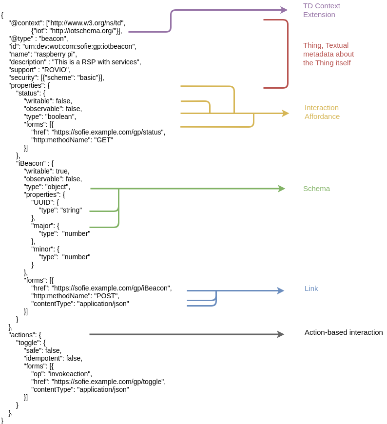

# Semantic Representation Component

Semantic representation (SR) is a mechanism for describing the data model and the services of IoT devices. It defines a common representation model for IoT Things devices, their services and their data, which enables interoperability and automation in the deployment of services and applications on top of federated IoT environments.

The Semantic Representation component is a logical component that can be implemented as part of other components to define the data and service models of an IoT system. The sematic represetation of this component is based on the Thing Description (TD) of W3T Web of Things (WoT) standards. A TD can be considered a standardized syntax to describe the interaction, the data schema, the metadata and the links of IoT devices or groups of devices.

## How to write an SR with WoT TD

The TD is a json file which resides in the IoT device's file system or in a device which will act as an entry point of an IoT system. This file is read by any external entity or a system to understand how the IoT device could be used.

A TD instance has four main components:

1. Textual metadata about the Thing itself
2. Interaction Affordances that indicate how the Thing can be used and how actors can interact with the Thing.
3. Schemas for the machine-readable data exchanged with the Thing, describing the data format used.
4. Links that express any formal or informal relationships with other Things or documents on the Web.

Below is a picture of the TD file used in the pilot:

When creating a TD is important to understand what the IoT device can do and the data type it can handle and share. Then the json file is built accordingly.
The list of standardized syntax can be found at: [WoT Thing Description](https://www.w3.org/TR/wot-thing-description/). Additional sintaxes can be added to the TD through the TD context extension, as shown in the figure above.

## How to read a SR with WoT TD

The common situation when using TD is when there is an IoT Device ("the Thing") exposing the TD and another device or system which needs to read the Thing TD ("the consumer"). The Thing is a device or a system of devices which can perform actions or share data. The consumer is a device or a system that can communicate with the Thing, reads the Thing's properties and interact with it.

Reading a TD is an operation that can be done following the WoT standard guidelines or creating an ad-hoc solution. The WoT standard imposes the creation of a component, the Servient, which includes scripts that can read the TD and understand the behaviour of the IoT devices. an Ad-hoc solution is what has been done in this Pilot, so the consumer's scripts are created knowing already the behaviour of the TD and not all the requirement of WoT standards are fulfilled. The second approach is quicker to implement, but it is less reusable.
